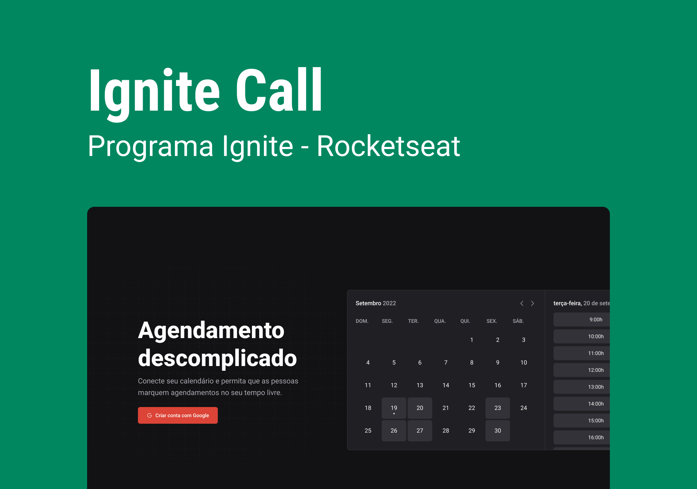

# Ignite Call

    

## :computer: Projeto

Este foi um projeto feito durante um curso para aprender a desenvolver apps desktop com Electron. O objetivo do projeto é criar arquivos para anotações que ficam salvos no localmente na sua máquina, com ele eu pude aprender a trabalhar com as camadas do Electron(Main, Preload e Renderer) e alguns funcionalidades nativas como o tray menu. Caso queira instalar na sua máquina, acesse esse [link](https://github.com/erik-ferreira/rotion/releases).

Este projeto foi construído com Next.js e tem o objetivo de agendar compromissos no Google Calendar a partir de um login com Google. Com ele pude trabalhar com a construção do backend com prisma, com o banco de dados utilizando mysql em um container do docker, rotas api através do servidor do Next e etc. O deploy do banco de dados foi feito no PlanetScale e o projeto em si foi feito na Vercel, acesse através desse link [https://ignite-call-7688nkhmy-erikferreira.vercel.app](https://ignite-call-7688nkhmy-erikferreira.vercel.app)

## :rocket: Tecnologias

- [React](https://reactjs.org)
- [Next.js](https://nextjs.org)
- [Prisma](https://www.prisma.io)
- [Zod](https://zod.dev)
- [React Hook Form](react-hook-form.com)
- Google APIs
- Google Cloud Platform
